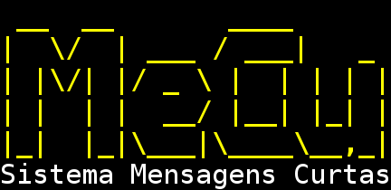

Criador: __Gil Barbosa Reis - 8532248__

Manual de instalação
====================

Introdução
----------
Esse é o manual de como instalar e rodar o sistema MeCu, cujo projeto está
hospedado nesse [repositório no github](https://github.com/gilzoide/webRepo),
em sua devida [pasta](https://github.com/gilzoide/webRepo/tree/master/MeCu).

Esse projeto é um sistema web construído usando [sailsjs](http://sailsjs.org/) no lado
servidor, e HTML5 e [AngularJS](https://www.angularjs.org/) no lado cliente.

Dependências
------------
Para rodar o sistema, é necessário ter os seguintes programas instalados:
- [nodejs](https://nodejs.org/en/)
- [npm](https://www.npmjs.com/)
- [sailsjs](http://sailsjs.org/)
- [PostgreSQL](https://www.postgresql.org/)

Siga as instruções de instalação especificadas nos sites para instalá-los em seu
Sistema Operacional

Release
-------

